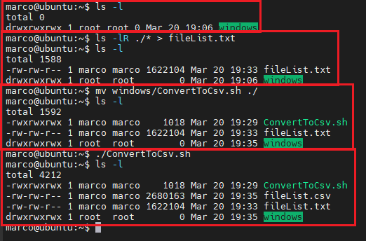
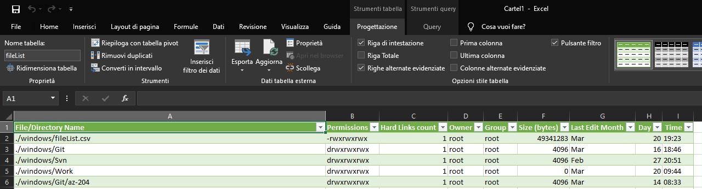

# List Files

This utility allows me to list all the files (subfiles/directory) in csv format

## Steps

- List all the files / directory into a file
  
  ~~~bash
  ls -lR PATH > fileList.txt
  ~~~

  Replace "PATH" with the folder that you want to scan, for example: ls -lR ./* > fileList.txt
- Place the script in the same folder of the file "fileList.txt"
- Run the script

  ~~~bash
  ./ConvertToCsv.sh
  ~~~

- The script will generate the "fileList.csv"

## Example

~~~csv
File/Directory Name;Permissions;Hard Links count;Owner;Group;Size (bytes);Last Edit Month; Day; Time
./windows/fileList.csv ;-rwxrwxrwx;1;root;root;49341283;Mar;20;19:23
./windows/Git ;drwxrwxrwx;1;root;root;4096;Mar;16;18:46
./windows/Svn ;drwxrwxrwx;1;root;root;4096;Feb;27;20:51
./windows/Work ;drwxrwxrwx;1;root;root;0;Mar;20;09:44
./windows/Git/az-204 ;drwxrwxrwx;1;root;root;4096;Mar;14;08:33
...
...
...
...
~~~

