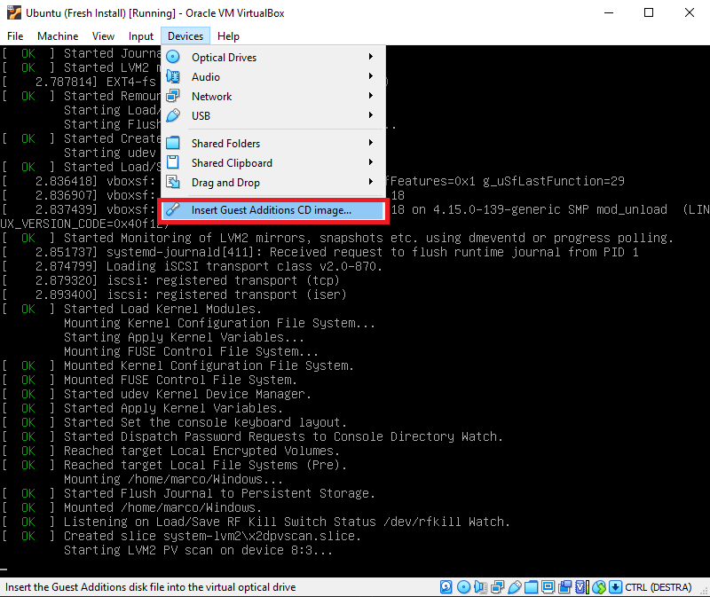

# Share Folder with the Host VM

When using Virtual Box you can configure in the settings a folder that can be shared between the host and client machine. Usually this folder "lives" on the host machine, and you just "make it available" to the client machine.
If the client runs a Windows OS, this tasks is very simple, but when using Linux you have to perform some extra steps. I made this script just reduce the number of copy & paste that I have to do.

## Requirements

- Virtual Box
- Ubuntu VM running in Virtual Box

## Procedure

- Run the VM and insert the "Guest Additions CD Image"
  
- SSH to the machine, run the script
  